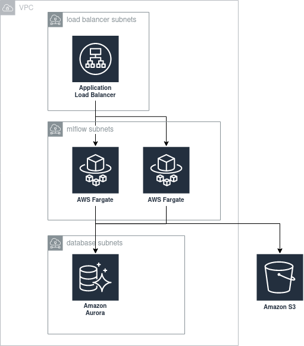

# terraform-aws-mlflow
[](./LICENSE)


A terraform module to productionalize [MLFlow](https://mlflow.org) on top of AWS.

---

This terraform module allows you to deploy a cluster of MLFlow servers + UI using:

- ECS Fargate as the compute engine
- Amazon Aurora Serverless as the backend store
- S3 as the default artifact root


## Design principles

When designing this module, we've made some decisions about technologies and configuration that might not apply to all use cases. In doing so, we've applied the following principles, in this order:

- __High availability and recovery__. All components are meant to be highly available and provide backups so that important data can be recovered in case of a failure. Database back-ups are activated, and versioning is enabled for the S3 bucket.
- __Least privilege__. We've created dedicated security groups and IAM roles, and restricted traffic/permissions to the minimum necessary to run MLFlow.
- __Smallest maintenance overhead__. We've chosen serverless technologies like Fargate and Aurora Serverless to minimize the cost of ownership of an MLFlow cluster.
- __Smallest cost overhead__. We've tried to choose technologies that minimize costs, under the assumption that MLFlow will be an internal tool that is used during working hours, and with a very lightweight use of the database.
- __Private by default__. As of version 1.9.1, MLFlow doesn't provide native authentication/authorization mechanisms. When using the default values, the module will create resources that are not exposed to the Internet. Moreover, the module provides server-side encryption for the S3 bucket and the database through different KMS keys.
- __Flexibility__. Where possible, we've tried to make this module usable under different circumstances. For instance, you can use it to deploy MLFlow to a private VPN and access it within a VPN, or you can leverage ALB's integration with Cognito/OIDC to allow users to access MLFlow from your SSO solution.


## Architecture

The following diagram illustrates the components the module creates with the default configuration:




## Usage

To use this module, you can simply:

```hcl
module "mlflow" {
  source  = "glovo/mlflow/aws"
  version = "1.0.0"

  unique_name                       = "mlflow-team-x"
  vpc_id                            = "my-vpc"
  load_balancer_subnet_ids          = ["public-subnet-az-1", "public-subnet-az-2", "public-subnet-az-3"]
  load_balancer_ingress_cidr_blocks = ["10.0.1.0/24"]
  service_subnet_ids                = ["private-subnet-az-1", "private-subnet-az-2", "private-subnet-az-3"]
  database_subnet_ids               = ["db-private-subnet-az-1", "db-private-subnet-az-2", "db-private-subnet-az-3"]
  database_password_secret_arn      = "mlflow-team-x-db-password-arn"
}
```

You can find a more complete usage example in [`terratest/examples/main.tf`](terratest/examples/main.tf).

Note you may also:

- Add sidecar containers (e.g. a [datadog agent for Fargate](https://www.datadoghq.com/blog/monitor-aws-fargate/))
- Provide your own bucket/path as the default artifact root
- Attach an autoscaling policy to the service (for instance, you may scale down to 0 instances during the night)


## Caveats / Notes

* This module only supports [this docker image](https://hub.docker.com/r/larribas/mlflow). The reason behind this is that we need to inject the database password as a secret environment variable, which can only be injected into the ECS task definition by overriding the entrypoint and making a lot of assumptions about how the base image was built.
* By default, the load balancer is internal. This is because as of v1.9.1, MLFlow doesn't have native authentication or authorization. We recommend exposing MLFlow behind a VPN or using OIDC/Cognito together with the LB listener.


## Roadmap

- [ ] PR to mlflow to accept BACKEND_STORE_URI as an environment variable => Allow selecting a different container image


## Contributors

Everybody is welcome to contribute ideas and PRs to this repository. We don't have any strict contribution guidelines. Follow your best common sense and have some patience with us if we take a few days to answer.
